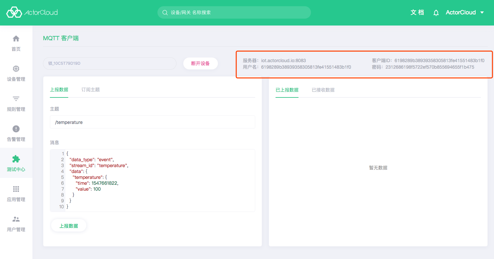

# MQTT 客户端


- 成功创建设备后，点击**测试中心** -> **MQTT 客户端**可以选取设备进行连接测试。按照设备名称搜索选择一个设备，点击启动连接到消息服务器。

#### 操作指南

- 上报数据：输入主题、消息进行数据上报，数据将记录到[上行消息](/device/connect_logs.md#上行消息)；
- 订阅主题：输入主题进行在线订阅；
- 已上报数据：仅包含设备在 MQTT 客户端连接后已上报的数据;
- 已接收数据：仅包含设备在 MQTT 客户端连接后已接收的数据，数据将记录到[下行消息](/device/connect_logs.md#下行消息)
- 



### 运行日志

- 设备连接会产生运行日志，在设备详情页**设备信息**标签页中，可以查看当前设备基本信息及运行日志。
  

- 根据 MQTT 特性和 **ActorCloud** 接入规则，相同 client Id 的设备不能同时在线，否则会产生"重连-互相踢下线"现象，请创建测试设备或选择离线设备进行调试；


### 设备事件

- 设备发布消息产生上行消息记录到设备事件，在设备详情页**设备事件**标签页中可以查看该记录。


### Token 认证

设备认证方式为 **Token** 时，使用设备编号，设备密钥，连接用户名可以连接到消息服务器：

- 设备编号：设备连接 MQTT 服务器时，client_id 即为设备编号；
- 设备密钥：对应设备连接时 MQTT 连接密码；
- 连接用户名：对应设备连接时 MQTT 连接用户名。

设备详情页**编码信息**标签页可以查看设备认证信息:


示例代码：

```python
# --coding: utf-8--

import paho.mqtt.client as mqtt
import json

# 设备需要在 ActorCloud 平台注册
client_id = '10C61F1A1F40'
username = '10C61F1A1F40'
password = 'ce07c199187811e8a12b525440546606'
PORT = 1883
HOST = 'iot.actorcloud.io'


def on_connect(client, userdata, flags, rc):
    print('Connected with result code ' + str(rc))
    client.subscribe('some_topic')


# 设备下发、分组控制及其他方式 publish 的消息统一在此处理
def on_message(client, userdata, msg):
    print('topic: {0}, payload: {1}'.format(msg.topic, str(msg.payload)))
    # 其他处理逻辑
    pass

# 设备务必使用用户名密码认证
client = mqtt.Client(client_id=client_id)
client.username_pw_set(username, password)

client.on_connect = on_connect
client.on_message = on_message

client.connect(HOST, PORT)

client.loop_forever()

```

### 单向认证

- 单向认证适用于认证方式为 **Token** 的设备，需要设备**编码信息**进行认证；

示例代码：

```python
# --coding: utf-8--

import ssl
import paho.mqtt.client as mqtt
import json

# 设备需要在 ActorCloud 平台注册
client_id = '10C61F1A1F40'
username = '10C61F1A1F40'
password = 'ce07c199187811e8a12b525440546606'
HOST = 'iot.actorcloud.io'
PORT = 8883


def on_connect(client, userdata, flags, rc):
    print('Connected with result code ' + str(rc))
    client.subscribe('/hello')
    client.publish('/hello', json.dumps({
        'hello': 'world'
    }))


# 设备下发、分组控制及其他方式 publish 的消息统一在此处理
def on_message(client, userdata, msg):
    print('topic: {0}, payload: {1}'.format(msg.topic, str(msg.payload)))
    # 其他处理逻辑
    pass

client = mqtt.Client(client_id=client_id)
# 单向认证仍需要用户名密码
client.username_pw_set(username, password)
# 设置证书信息
client.tls_set(certfile=None, keyfile=None, cert_reqs=ssl.CERT_REQUIRED, ciphers=None)
client.on_connect = on_connect
client.on_message = on_message

client.connect(HOST, PORT)

client.loop_forever()
```

# 双向认证

- 双向认证适用于认证方式为**证书**的设备，需要使用 **ActorCloud** 根证书 + 自签名证书，证书密钥进行认证。


设备绑定相应证书详情页中，点击**下载证书**后解压文件得到：

- **root_ca.crt** ： **ActorCloud** 根证书；
- **证书名称.crt** ： 自签名证书；
- **证书名称.key** ：自签名证书密钥。

> 使用双向认证接入的设备无需密码验证，但双向认证设备需绑定并使用其匹配证书才能认证成功。


示例代码：

```python
# --coding: utf-8--

import ssl
import paho.mqtt.client as mqtt
import json

# 设备需要在 ActorCloud 平台注册且认证方式为 "证书"
client_id = '10C61F1A1F41'
username = '10C61F1A1F41'
password = '630a7f6b54d75e50a2e59b4baca722d4'
HOST = 'iot.actorcloud.io'

# 双向认证端口
PORT = 8884


def on_connect(client, userdata, flags, rc):
    print('Connected with result code ' + str(rc))
    client.subscribe('/hello')
    client.publish('/hello', json.dumps({
        'hello': 'world'
    }))


# 设备下发、分组控制及其他方式 publish 的消息统一在此处理
def on_message(client, userdata, msg):
    print('topic: {0}, payload: {1}'.format(msg.topic, str(msg.payload)))
    # 其他处理逻辑
    pass

client = mqtt.Client(client_id=client_id)
# 双向认证只需要使用用户名
client.username_pw_set(username)
# 设置 PROT 为 8884 并设置根证书、签名证书及密钥路径
client.tls_set(ca_certs='./root_ca.crt', certfile='./default.crt', keyfile='./default.key', cert_reqs=ssl.CERT_REQUIRED,
    tls_version=ssl.PROTOCOL_TLS, ciphers=None)
client.on_connect = on_connect
client.on_message = on_message

client.connect(HOST, PORT)

client.loop_forever()
```


#### 注意事项

- 根据 MQTT 特性和 **ActorCloud** 接入规则，相同 ClientId 的设备不能同时在线，否则会产生"重连-互相踢下线"现象，请创建测试设备或选择离线设备进行调试；

- 暂不支持双向认证接入。

