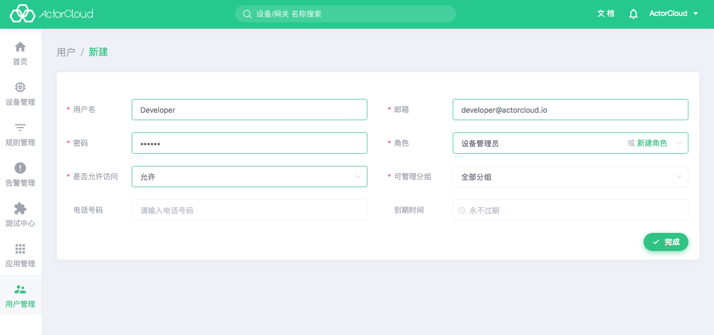
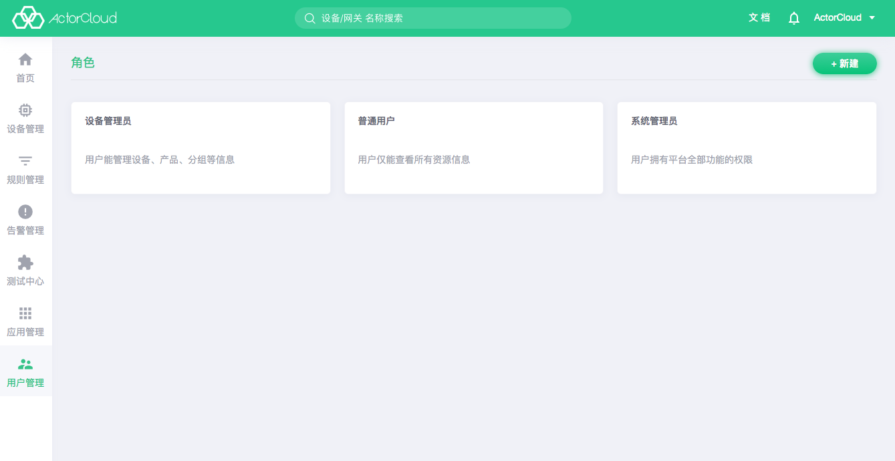
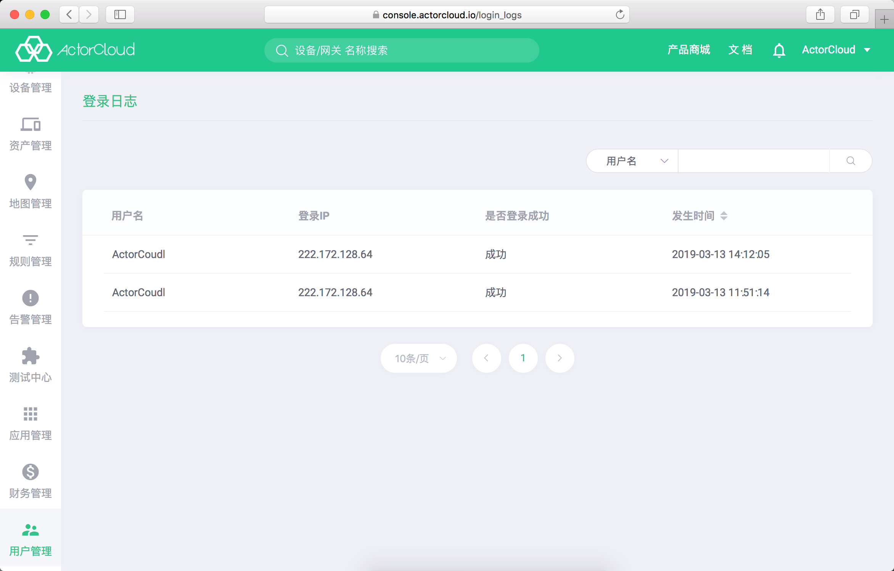

# 用户

**ActorCloud** 提供完善的系统管理功能，公司账号可以进行用户管理、用户权限控制、邀请注册、用户角色管理等操作。

- 进入 **用户管理->用户** 点击**用户**标签页，可查看当前账户下用户列表，点击右上角**新建**可创建一个用户，该用户隶属于当前账号所在公司，通过选择**角色**赋予其对平台使用的权限。选择可管理分组，可以对分组下的设备网关进行管理。

- 新用户必须归属于一个角色，新建用户前需创建好用户所属角色。

### 用户邀请

进入 **用户管理->用户** 点击**邀请记录**标签页，可查看当前账户邀请用户记录，点击右上角**邀请**可进行邀请用户注册操作，该用户隶属于当前账号所在公司，**ActorCloud** 将发送包含邀请链接的邮件到用户邮箱，通过点击邀请链接可以完成激活注册。

# 角色

进入 **用户管理->角色**，用户必须通过用户角色分配权限，新建用户需关联相关角色。**ActorCloud** 默认提供三种级别的用户角色：

- 普通用户：仅能查看所有资源信息；

- 设备管理员：能管理设备、产品、分组等信息，包括新建，修改，删除操作；

- 系统管理员：拥有平台全部功能的权限，可以创建新的用户。

默认角色不允许修改，需要更细微的角色控制可以进行新建手动选取。

# 消息中心

消息中心包含 **ActorCloud** 一些消息通知等。

# 登录日志

进入 **用户管理->登录日志** 可查看 **ActorCloud** 记录账户下所有账号登录日志。支持对用户名和登录 IP 的搜索过滤。

通过查看登录日志可以检测异常登录，保护账号安全。

